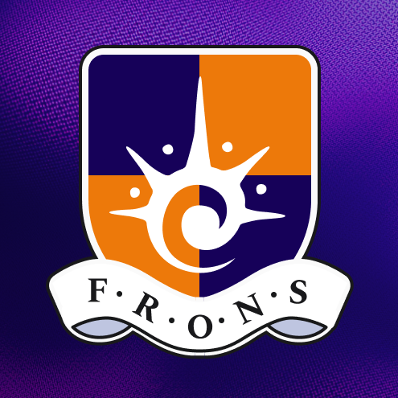

> The existing README.md file was outdated and did not reflect the current state of the project. It has been replaced with this new, comprehensive README.md.

# frons.id



**frons.id** is a next-generation productivity workspace built on the Solana blockchain. It combines a suite of powerful productivity tools with engaging GameFi mechanics to help you stay focused, motivated, and rewarded for your work. Inspired by the "Work-from-Coffee" concept, frons.id provides a customizable and immersive environment to boost your productivity.


## ✨ Key Features

frons.id offers a rich set of features designed to enhance your workflow and make work more enjoyable:

###  Productivity Suite

*   **Customizable Pomodoro Timer:** A flexible timer with customizable presets for work and break sessions.
*   **Session Log:** Automatically tracks your work sessions and provides a detailed history of your activity.
*   **Rich Text Notepad:** A powerful notepad for taking notes, brainstorming ideas, and organizing your thoughts.
*   **Bookmark Manager:** Save and organize your favorite websites and resources.
*   **Music Player:** An integrated music player with YouTube support to help you stay in the flow.
*   **Ambient Sounds:** A selection of ambient sounds (e.g., coffee shop, rain, forest) to create the perfect work atmosphere.
*   **To-Do List:** A simple yet effective to-do list to manage your tasks.

### GameFi & Rewards

*   **NFT Profiles:** Showcase your achievements and identity with a unique NFT-based profile.
*   **Achievements & Levels:** Unlock achievements and level up as you complete work sessions.
*   **Daily Challenges & Streaks:** Stay motivated with daily challenges and build a work streak.
*   **Leaderboard:** Compete with other users and climb the ranks of the leaderboard.
*   **Theme Customization:** Personalize your workspace with a variety of themes and cosmetic items.


## 🚀 Getting Started

### Prerequisites

*   [Node.js](https://nodejs.org/en/) (v18 or higher)
*   [Yarn](https://yarnpkg.com/)
*   [Rust](https://www.rust-lang.org/)
*   [Solana CLI](https://docs.solana.com/cli/install-solana-cli-tools)
*   [Anchor](https://www.anchor-lang.com/)

### Installation

1.  **Clone the repository:**

    ```bash
    git clone https://github.com/rejoelm/frons.git
    cd frons
    ```

2.  **Install web dependencies:**

    ```bash
    cd web
    yarn install
    ```

3.  **Install program dependencies:**

    ```bash
    cd ../programs/frons
    cargo build
    ```

### Running the Application

1.  **Start the web server:**

    ```bash
    cd web
    yarn dev
    ```

2.  **Deploy the Solana program (optional):**

    If you want to interact with the on-chain features, you'll need to deploy the Solana program to your local validator or devnet.

    ```bash
    solana-test-validator
    anchor deploy
    ```

## 💻 Tech Stack

*   **Frontend:** [Next.js](https://nextjs.org/), [React](https://reactjs.org/), [TypeScript](https://www.typescriptlang.org/), [Tailwind CSS](https://tailwindcss.com/)
*   **Backend (Blockchain):** [Solana](https://solana.com/), [Anchor](https://www.anchor-lang.com/)
*   **Wallet Integration:** [Solana Wallet Adapter](https://github.com/solana-labs/wallet-adapter)

## 🖼️ Screenshots

| Feature | Screenshot |
| --- | --- |
| Main Workspace |  |
| GameFi Dashboard |  |


## 🤝 Contributing

Contributions are welcome! Please feel free to submit a pull request or open an issue.

## 📄 License

This project is licensed under the MIT License. See the [LICENSE](LICENSE) file for details.

